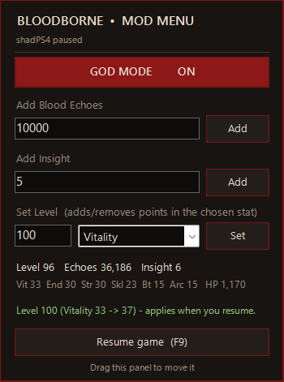

# Bloodborne-shadps4-mod-menu

# Bloodborne Mod Menu for shadPS4

A small pause-menu overlay for **Bloodborne (PS4) running in the [shadPS4](https://github.com/shadps4-emu/shadPS4) emulator** on Windows.
Press the emulator's pause key in game and the mod menu appears on top of the game window.



## Features

| Option | What it does |
|---|---|
| **God Mode** (on/off) | You take no damage - your HP stays at maximum. Only affects your own character. |
| **Add Blood Echoes** | Adds (or, with a negative number, removes) Blood Echoes. Max 999,999,999. |
| **Add Insight** | Adds or removes Insight. Max 99. |
| **Set Level** | Type the level you want and pick a stat (Vitality, Endurance, Strength, Skill, Bloodtinge, Arcane). That stat gets the extra points, or loses them when you lower your level (each stat stays between 1 and 99). The change goes through the game's own level-up code, so max HP, stamina and defense update exactly like a real level-up. No echoes are spent. |

The panel also shows your current level, echoes, insight, stats and max HP.

Nothing is written to your game files or save files on disk - the mod only changes the running game in memory.
Your save is updated the normal way, by the game's own autosave.

## Prerequisites

| Requirement | Details |
|---|---|
| **Windows 10 or 11, 64-bit** | The mod is a native Windows app. |
| **.NET Framework 4.x** | Already built into Windows 10 and 11 - nothing to install. |
| **shadPS4 (Windows build)** | Tested with shadPS4 **v0.19.0**. The SDL emulator window (`shadPS4.exe`) must be running; the Qt launcher alone is not enough. |
| **Bloodborne with update 1.09** | Tested with **CUSA03173 (Game of the Year Edition) + 1.09 eboot**. Other regions with the 1.09 eboot may work: the mod checks the game code before changing anything and refuses to run if it doesn't match. |
| **Pause hotkey** | The mod opens when shadPS4 pauses emulation (default **F9**). It reads `hotkey_pause` from shadPS4's `input_config/global.ini`, so a custom single-key binding is picked up automatically. |

No administrator rights are needed, unless you run shadPS4 itself as administrator - then run the mod as administrator too.

## Installation

1. Download `BloodborneModMenu-v1.0.0-win-x64.zip` from the [Releases](../../releases) page.
2. Extract it anywhere (for example next to shadPS4).
3. Run `BloodborneModMenu.exe`. It lives in the system tray (red circle icon) - there is no main window.

The mod and the game can be started in any order. If you restart the game, the mod reconnects by itself.

## Usage

1. Start Bloodborne in shadPS4 and load your character.
2. Press **F9** (shadPS4's pause key). The game pauses and the mod menu appears over the game window.
3. Use the options. Echoes and Insight change immediately; a level change is applied the moment you resume.
4. Press **F9** again (or click **Resume game**) to keep playing.

| Key / action | Effect |
|---|---|
| F9 in game | Pause and show the mod menu |
| F9 / *Resume game* while the menu has focus | Resume the game |
| Enter in a text box | Same as clicking the button next to it |
| Esc | Give keyboard focus back to the game window |
| Drag the panel | Move it; the position is remembered (`BloodborneModMenu.ini`) |
| Tray icon > *Show mod menu now* | Open the panel without pausing |
| Tray icon > *Exit* | Quit the mod (God Mode is switched off) |

## Good to know

- **Online play:** please don't use God Mode or edited levels against other players (co-op / PvP / invasions). It's unfair to them, and community servers may ban you.
- **Falling into a pit** with God Mode on can leave you falling forever - just turn God Mode off.
- **Lowering your level** also lowers your current HP by the max HP you lose. Heal once and you're full again.
- The level change needs one game frame to apply, so it happens right after you resume.

## Troubleshooting

| Problem | Fix |
|---|---|
| The menu doesn't appear on F9 | Make sure the game window has focus when you press F9. You can also right-click the tray icon > *Show mod menu now*. |
| "No character loaded yet" | Load your save and get in game first. On the title screen there is nothing to edit. |
| "Game code differs from Bloodborne 1.09" | Your eboot isn't the 1.09 version, or another patch/cheat changed the same code. The mod refuses to patch rather than risk a crash. |
| "Already running" message | The mod is already in the tray. |
| Antivirus warning | The mod writes into another process's memory (that's how all trainers work), which some antivirus tools flag. You can build it yourself from source (below) if you prefer. |

## How it works

shadPS4 runs PS4 code natively, so the game's code and data live inside the `shadPS4.exe` process. The Bloodborne executable is always mapped at `0x800000000`.

When the mod starts, it briefly freezes the process, checks that the game code is exactly the 1.09 code it expects, and writes two tiny hooks into unused padding inside the game's memory:

- **Hook A** (per-frame player update) - records your own character (not co-op phantoms) and runs queued level changes by calling the game's own level-up handler, which recalculates every derived stat.
- **Hook B** (the game's *set HP* function) - when God Mode is on and the target is your character, damage is replaced with max HP.

Echoes, Insight, level and stats are read and written in your character's `PlayerGameData`, found through the game's own `GameDataMan` / `WorldChrMan` pointers. Before any change, the mod double-checks the data (for example *level = sum of the six stats − 50*) and refuses to write if anything looks off.

"Paused" is detected by checking whether shadPS4 has suspended the game's threads, which is what its pause hotkey does.

## Building from source

No Visual Studio or SDK needed - Windows already contains the C# compiler.

```bat
build.bat
```

This produces `BloodborneModMenu.exe` next to `build.bat`. (Exit the mod from the tray first if it is running, otherwise the exe is locked.)

Source layout:

| File | Purpose |
|---|---|
| `src/GameMemory.cs` | Process access, hook installation, game data (offsets for Bloodborne 1.09) |
| `src/MenuForm.cs` | The overlay panel, tray icon, pause detection |
| `src/Native.cs` | Win32 API declarations |
| `src/Program.cs` | Entry point and command-line diagnostics |

### Diagnostics

Run these from a command prompt while the game is running; results go to `BloodborneModMenu.log` next to the exe.

| Command | Purpose |
|---|---|
| `BloodborneModMenu.exe --probe` | Show hook state, player pointers, level, stats, echoes |
| `BloodborneModMenu.exe --install` | Install the hooks without opening the menu |
| `BloodborneModMenu.exe --dump-pgd` | Dump the raw `PlayerGameData` block |
| `BloodborneModMenu.exe --set-level <level> <stat 0-5>` | Change level from the command line (0 = Vitality ... 5 = Arcane) |

## Credits

- HP and Blood Echo code locations for 1.09 were first identified by **Shiningami** in the [GoldHEN Cheat Repository](https://github.com/GoldHEN/GoldHEN_Cheat_Repository) (`CUSA03173_01.09.json`).
- The [shadPS4](https://github.com/shadps4-emu/shadPS4) team for the emulator.

## Disclaimer

This is an unofficial fan project, not affiliated with or endorsed by FromSoftware, Sony Interactive Entertainment or the shadPS4 project.
Use it at your own risk and keep a backup of your save data.

